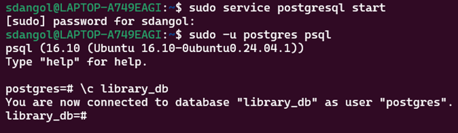
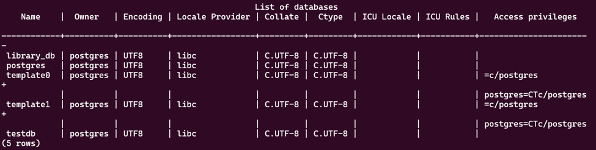
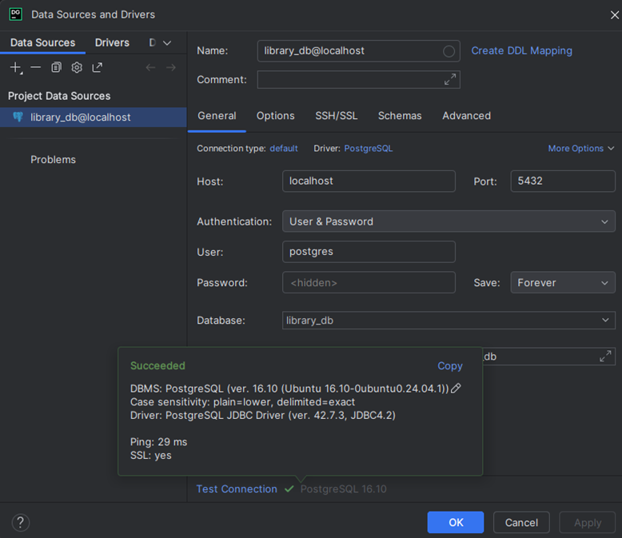
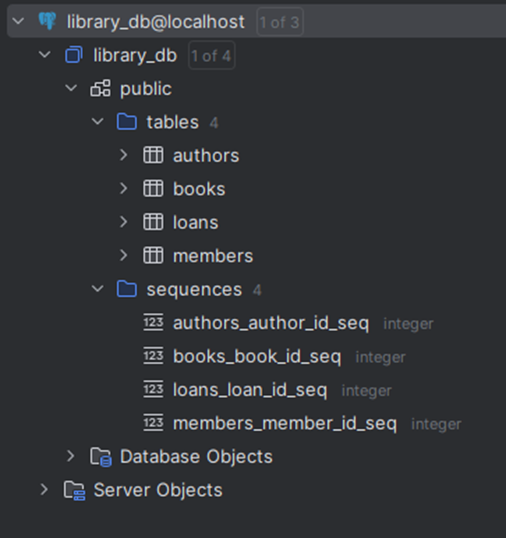
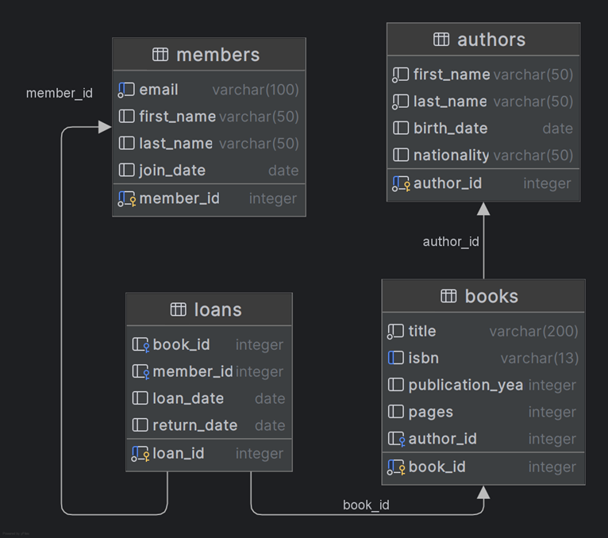
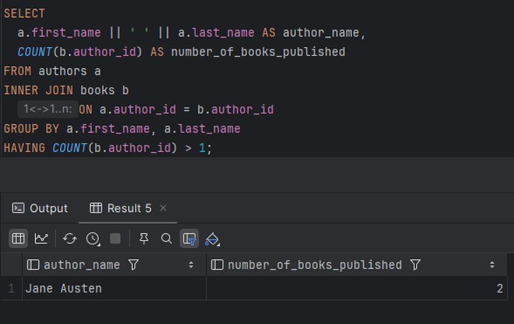
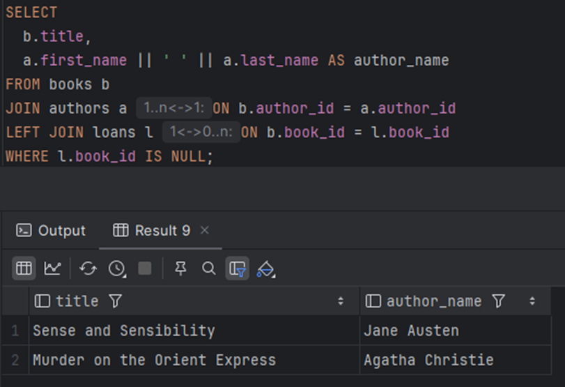
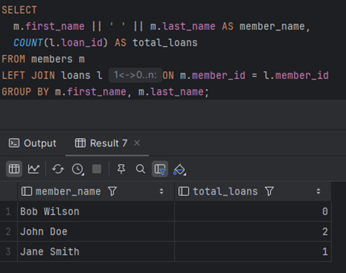
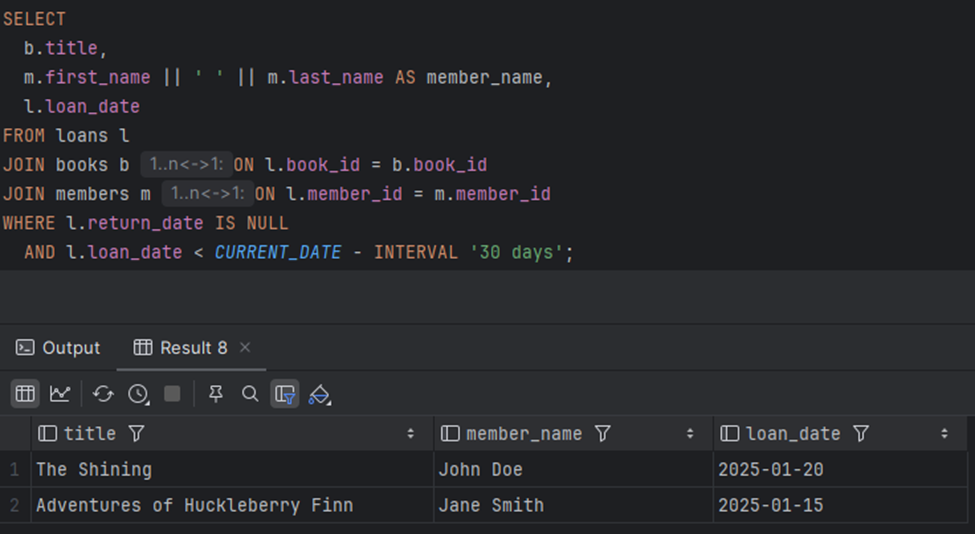
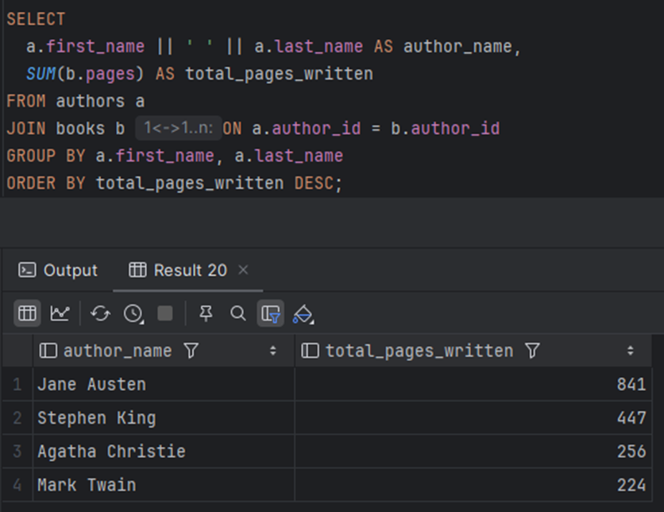

1.	Screenshot of CLI PostgreSQL connection

 
2.	Screenshot of DataGrip with your database
 
 
 
3.	DataGrip ER diagram (export as image)

 
4.	Your 5 SQL queries with results
1.	Find authors who have written more than one book

 
2.	Show books that have never been borrowed

 
3.	Count how many books each member has borrowed

 
4.	List all overdue books (books borrowed more than 30 days ago and not returned)

 
5.	Display authors along with the total number of pages they have written 

 
 
5.	Brief reflection (200 words) on setup challenges
I installed the Windows Subsystem for Linux (WSL) on my Windows system using PowerShell. Subsequently, I downloaded and installed Ubuntu, accessed it through PowerShell, and began working in the command-line interface (CLI) environment. I also installed and configured the PostgreSQL database.
Initially, working in the CLI environment was somewhat challenging, as it required the use of Linux commands. I was also uncertain about how to restart the process after closing the PowerShell tab. Upon consulting my lecturer, Bobby, I learned how to set Ubuntu as the default environment so that each time a new PowerShell tab is opened, it automatically launches Ubuntu.
During this process, I learned how to create databases and tables, insert data into tables, and display the available databases.
After completing the tasks in the CLI environment, I downloaded and installed DataGrip to manage the PostgreSQL database through a graphical interface. Since DataGrip was a new tool for me, Bobby provided guidance on how to create and connect to specific databases. While establishing the connection, I encountered issues related to the database username and password. With his assistance, I was able to select the correct username and reset the password. Eventually, I successfully connected to the database and explored the feature in DataGrip that automatically generates Entity-Relationship (ER) diagrams.

