Part 1: Create Database Schema

Step 1: Create Database (Created database using CLI mode)

CREATE DATABASE course_registration_db;
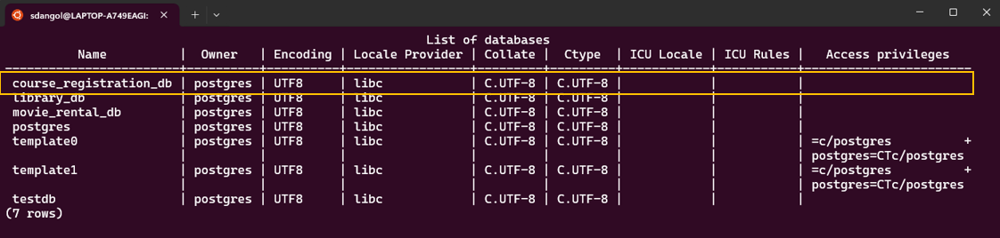

Step 2: Create Tables

Table 1 : Students Table
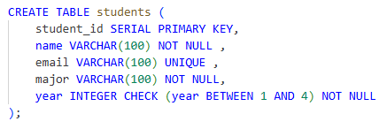

Table 2 : Courses table
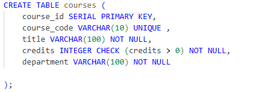

Table 3 : Professors table
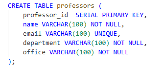

Table 4 : Enrollments table
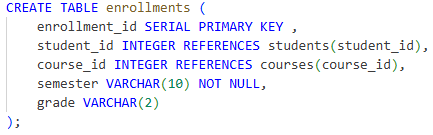

Table 5 : CourseOfferings table
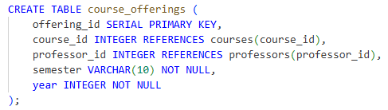

Part 2: Sample data (SELECT * from each table)

Sample Data 1 : Students
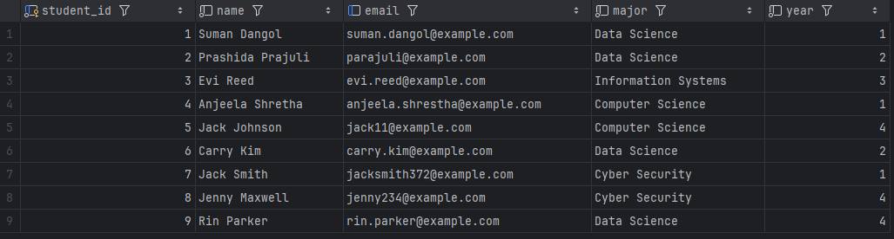

Sample Data 2 : Courses
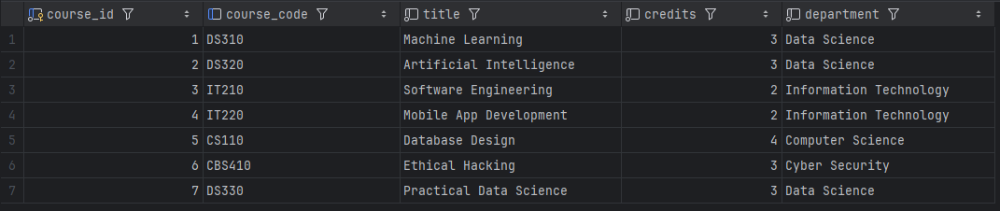

Sample Data 3 : Professors
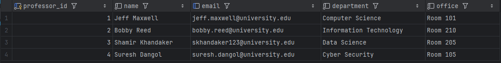

Sample Data 4 : Enrollments
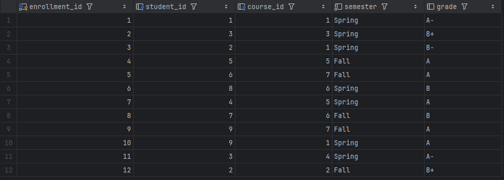

Sample Data 5 : Course_offerings
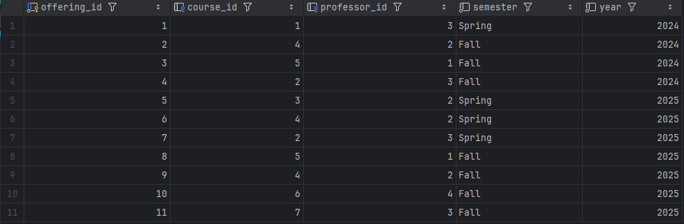

Part 3: All 5 query results

Query 1: List all students with their majors and year
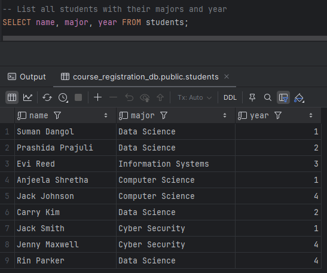

Query 2: Show which courses each student is enrolled in (JOIN)
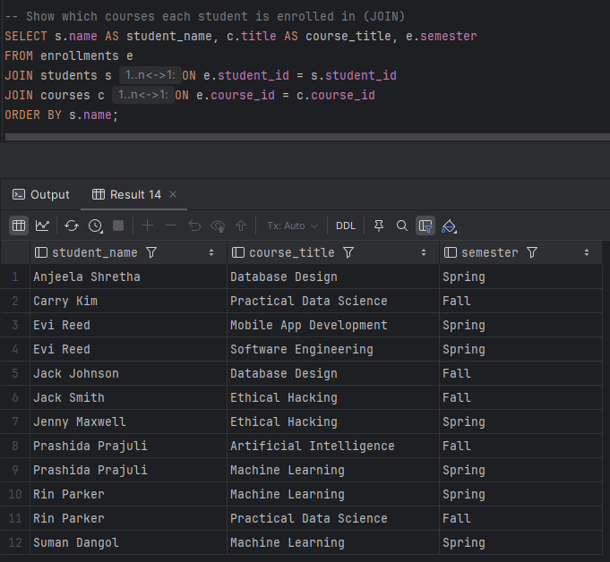

Query 3: Find which professor teaches which course (JOIN with CourseOfferings)
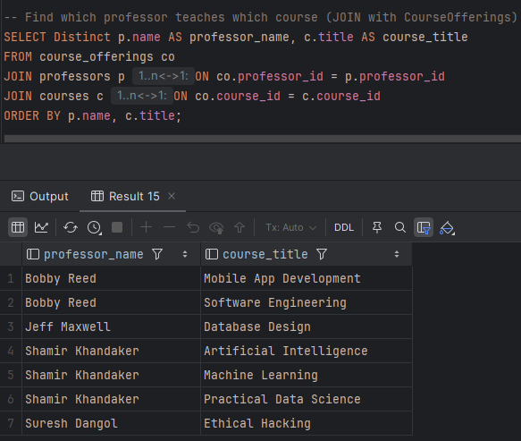

Query 4: Count how many students are in each course (GROUP BY)
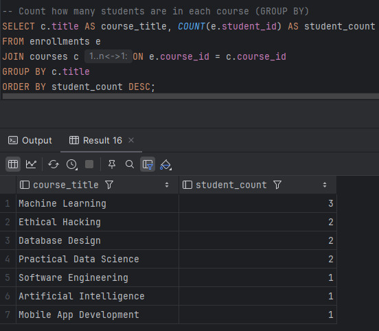

Query 5: Professors who taught in every semester of a given year
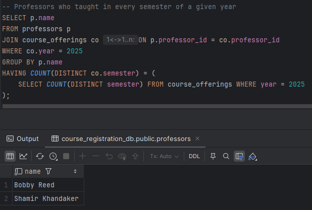

