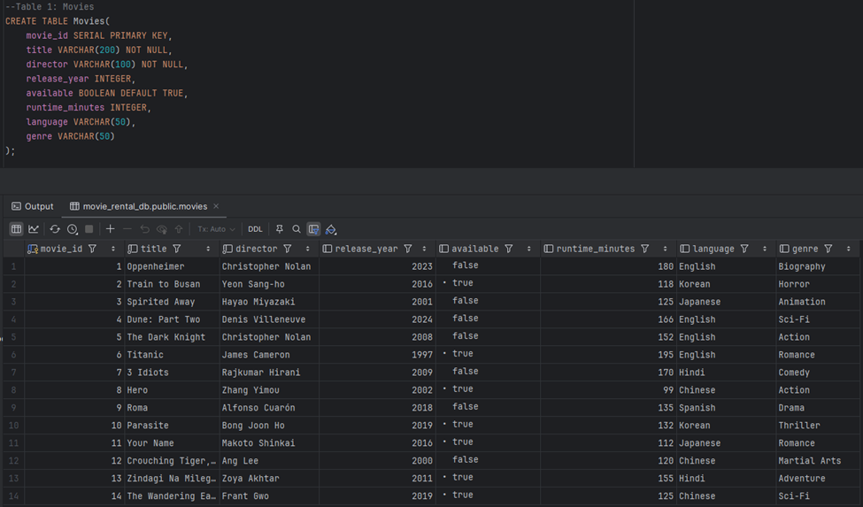
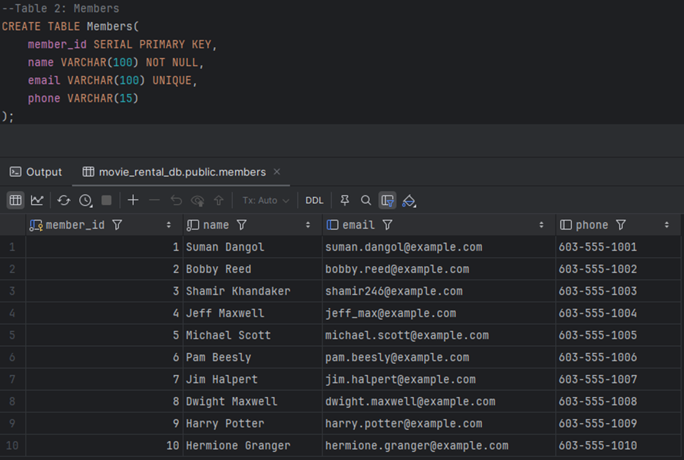
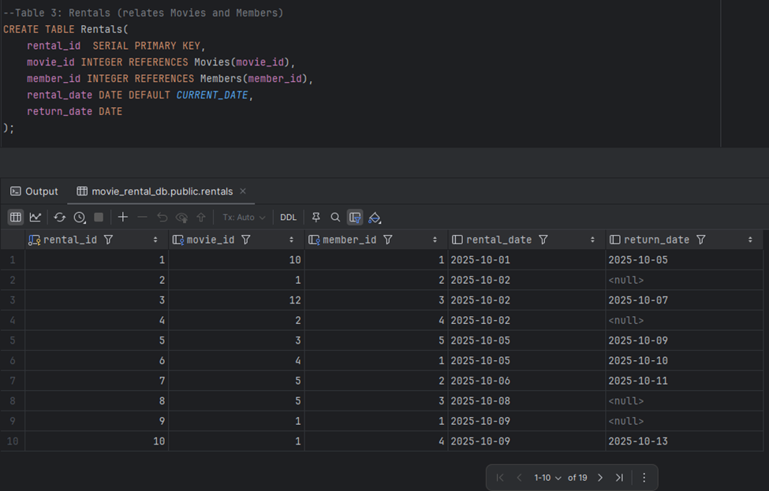
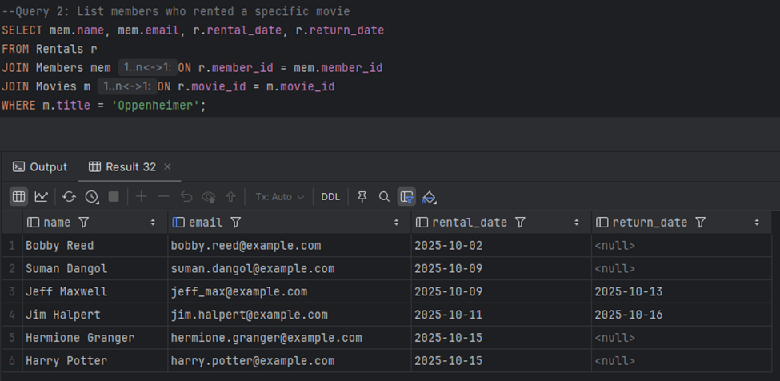
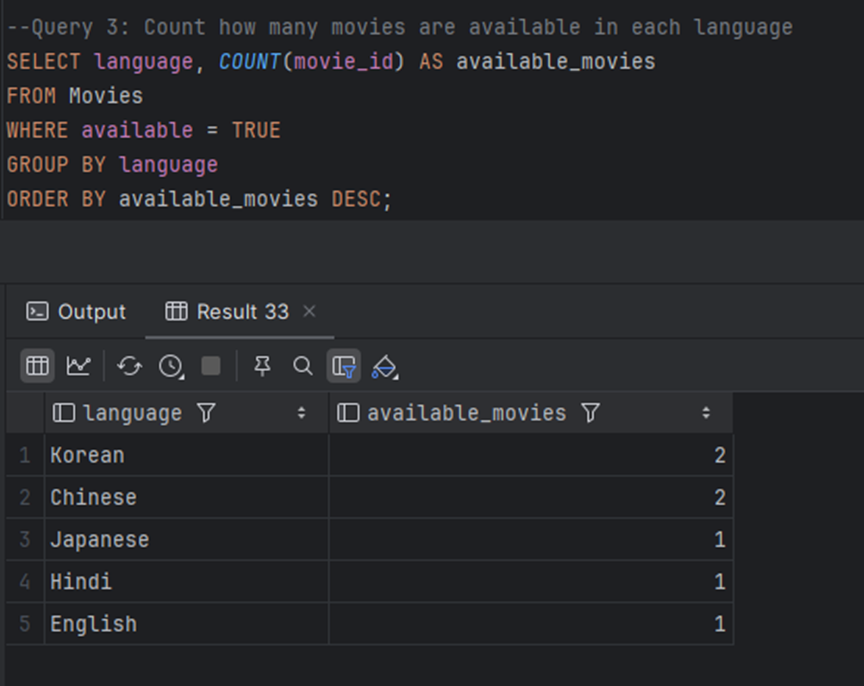
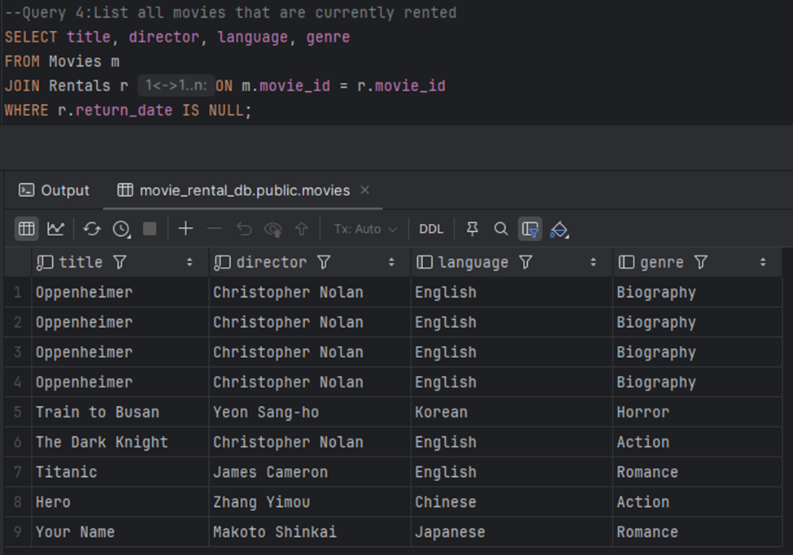
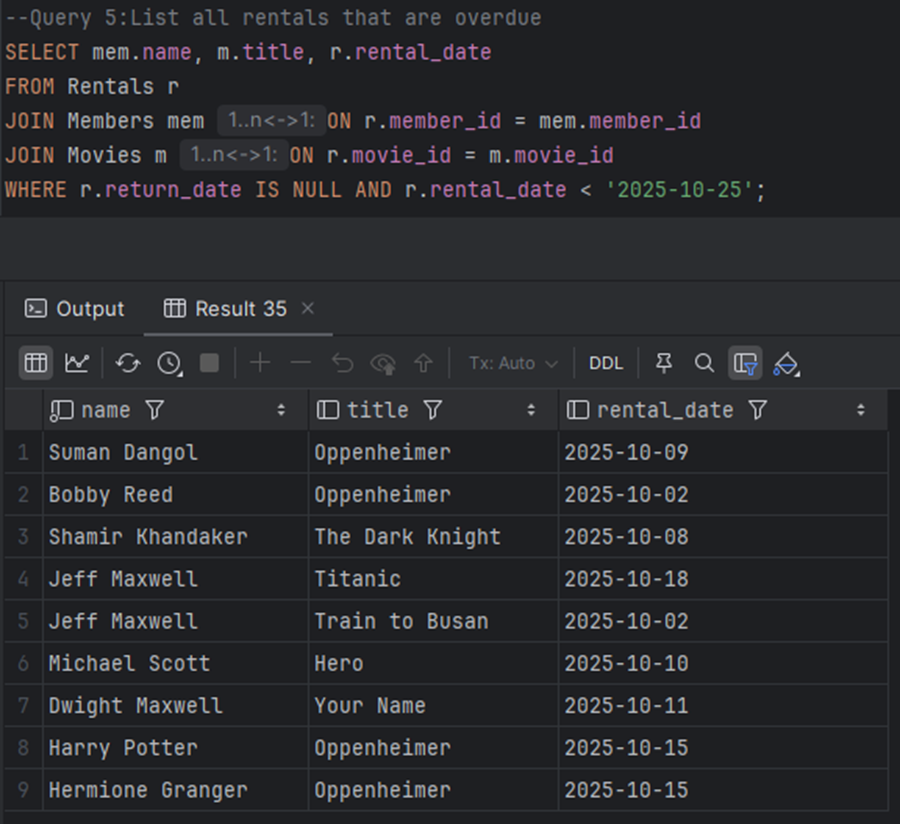
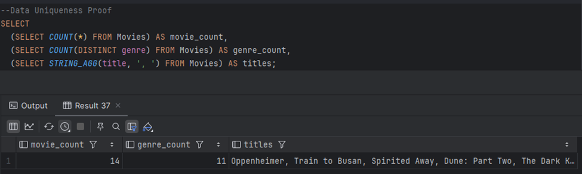

# Movie Rental Database

## Screenshot Evidence
### Sample data (SELECT * from each table)
Table 1: Movies

Table 2: Members

Table 3: Rentals

---

### Screenshot showing the result of JOIN queries
Query 1: Find members who have rented more than 1 movie

Query 2: List members who rented a specific movie

### Additional 3 queries
Query 3: Count how many movies are available in each language

Query 4:List all movies that are currently rented

Query 5:List all rentals that are overdue

---

### Data Uniqueness Proof

